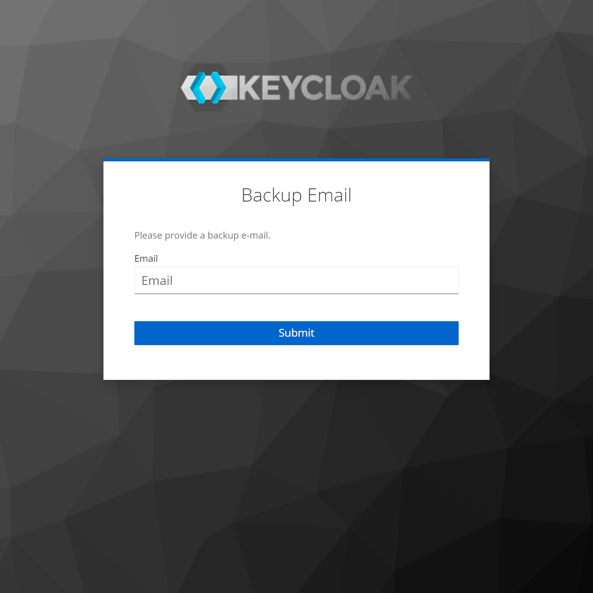
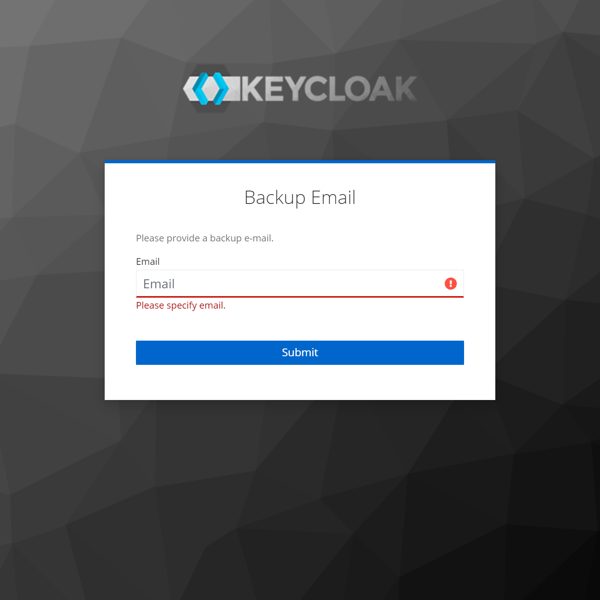
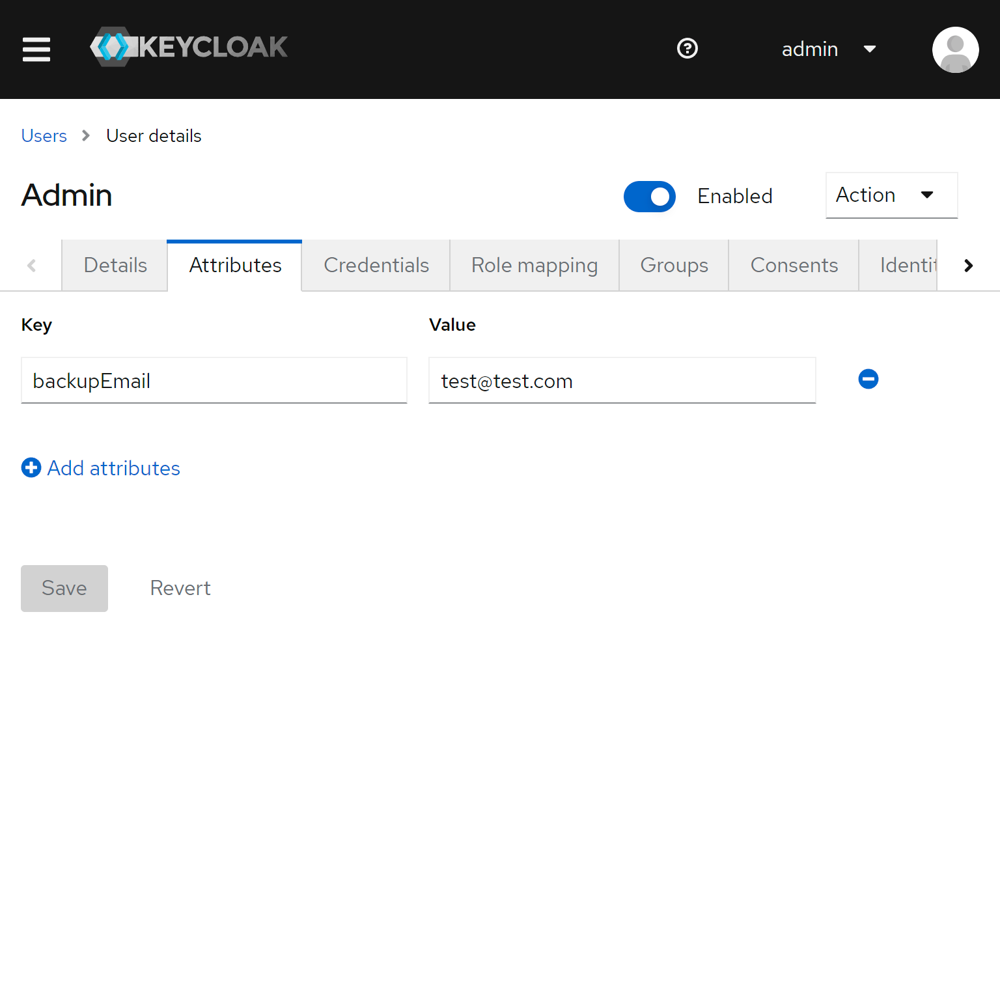

# Keycloak Backup Email Required Action

This extension adds a required action to force the user to setup 
a backup email. The email is stored as a user attribute and can 
be mapped with a user attribute token mapper into the user info 
endpoint or tokens.

**Features**

* require user to setup backup email
* support for english and german localization
* storing backup email as user attribute
* force an backup email update by assigning the required action to a user via the admin console

## Screenshots

### Backup Email Form

### Backup Email Error (inpit missing)

### Backup Email Error (input invalid)

### User Attribute in Admin Console
 

## Installation

* Download the latest release from the release page
* Move the jar to `/opt/keycloak/providers`
* Make sure it is loaded correctly by checking the provider info in the admin-console
* Enable the required action `Backup Email` for your realm 